# 🛡️ Project Sentinel: Advanced Biometric Authentication for Linux

<div align="center">

**A secure, daemon-based face recognition system designed to bring "Windows Hello"-like biometric unlock to Linux desktops.**

Built for **Fedora 43 / Wayland** | Powered by **ONNX Runtime** & **MediaPipe** | Privacy-First — **100% Local Processing**

</div>

---

> [!WARNING]
> **🚧 Work In Progress — GTK App Under Active Development 🚧**
>
> The **Vala/GTK4 desktop application** (enrollment & settings UI) is currently **under active development**. I am learning **Vala** to build a native, high-performance GNOME application for this project. The core biometric engine and daemon are fully functional, but the GTK app's installation and integration are still being worked on.
>
> **If you have experience with Vala, GTK4, or Meson and would like to help build the app, your contributions would be incredibly valuable!** Feel free to open an issue or submit a pull request.

---

## 📖 Table of Contents

- [Overview](#-overview)
- [Key Features](#-key-features)
- [System Architecture](#%EF%B8%8F-system-architecture)
- [How It Works](#-how-it-works)
- [Prototype for Testing](#-prototype-for-testing)
- [Installation](#%EF%B8%8F-installation)
- [Face Enrollment](#-face-enrollment)
- [GTK App (WIP)](#-gtk-app-installation-wip)
- [Configuration](#-configuration)
- [Project Structure](#-project-structure)
- [Contributing](#-contributing)
- [License](#-license)

---

## 🌟 Overview

**Project Sentinel** is a comprehensive biometric authentication system for Linux. It acts as a persistent background daemon that keeps AI models warm in memory, enabling near-instant face recognition (**<100ms** response time) for GDM login and lock screen unlock.

Unlike cloud-based solutions, **all processing happens entirely on your machine**. Your face embeddings, intrusion logs, and camera data never leave your device.

---

## 🚀 Key Features

| Feature | Description |
|---|---|
| ⚡ **Instant Unlock** | Daemon architecture keeps models loaded in memory for <100ms response time |
| 🔐 **Multi-Tier Security** | Golden / Standard / 2FA confidence zones with escalating access control |
| 👁️ **Liveness Detection** | Anti-spoofing using MiniFASNet ONNX models to prevent photo/video attacks |
| 🎯 **Interactive Challenges** | Random head-turn challenges + mandatory blink test for robust liveness verification |
| 🧠 **Adaptive Embeddings** | System learns your face over time (lighting, glasses, aging) via a FIFO adaptive gallery |
| 🚨 **Intrusion Detection (IDS)** | Detects and logs unrecognized faces with screenshots; blacklists repeat offenders |
| 📷 **IR Camera Support** | Auto-detection for infrared cameras (future-ready) |
| 🔧 **PAM Integration** | Native `pam_exec` integration with GDM for seamless login/unlock |
| 🖥️ **Kalman Tracking** | Target locking with Kalman filter for stable face tracking across frames |
| 📊 **Audit Logging** | Detailed daily log files with 30-day FIFO retention |

### Multi-Tier Confidence System

The system uses cosine distance between face embeddings to determine access:

| Zone | Distance Threshold | Action |
|---|---|---|
| 🥇 **Golden** | ≤ 0.25 | Instant access + adaptive learning |
| ✅ **Standard** | ≤ 0.42 | Standard access granted |
| ⚠️ **Two-Factor** | ≤ 0.50 | Requires liveness check + PIN/password |
| ❌ **Failure** | > 0.50 | Access denied, intrusion logged |

---

## 🏗️ System Architecture

The system follows a **client-daemon** architecture with three core layers:

```mermaid
graph TB
    subgraph User Layer
        GDM["🖥️ GDM Login Screen"]
        LockScreen["🔒 Lock Screen"]
        GTKApp["🛠️ Sentinel GTK4 App<br/><i>(WIP - Vala)</i>"]
    end

    subgraph IPC Layer
        PAMClient["📜 PAM Client<br/><code>sentinel_client.py</code>"]
        UnixSocket["🔌 Unix Domain Socket<br/><code>/run/sentinel/sentinel.sock</code>"]
        JSONRPC["📡 JSON-RPC Protocol"]
    end

    subgraph Daemon Layer ["Sentinel Daemon (sentinel_service.py)"]
        RPC["RPC Dispatcher"]
        SentinelService["SentinelService<br/>Request Handler"]
    end

    subgraph Core Engine ["Biometric Processing Engine (biometric_processor.py)"]
        BP["BiometricProcessor<br/>Model Manager"]
        SA["SentinelAuthenticator<br/>Auth State Machine"]
        LV["LivenessValidator<br/>Challenge Manager"]
        SD["SpoofDetector<br/>MiniFASNet"]
        BD["BlinkDetector<br/>EAR Algorithm"]
        FES["FaceEmbeddingStore<br/>Gallery Manager"]
        BLM["BlacklistManager<br/>Intrusion Detection"]
        AM["AdaptiveManager<br/>Embedding Learner"]
        KST["KalmanStabilityTracker<br/>Face Tracking"]
    end

    subgraph AI Models ["ONNX AI Models"]
        YuNet["YuNet<br/>Face Detection"]
        SFace["SFace<br/>Face Recognition<br/>(128-d Embeddings)"]
        MiniFAS["MiniFASNetV2<br/>Anti-Spoofing"]
        MP["MediaPipe<br/>Face Mesh (468 pts)"]
    end

    subgraph Storage
        Gallery["📁 Face Galleries<br/><code>gallery_*.npy</code>"]
        Blacklist["🚫 Blacklist DB<br/><code>models/blacklist/</code>"]
        Config["⚙️ config.ini"]
        Logs["📝 Audit Logs<br/><code>logs/</code>"]
    end

    GDM -->|"pam_exec"| PAMClient
    LockScreen -->|"pam_exec"| PAMClient
    GTKApp -->|"JSON-RPC"| UnixSocket
    PAMClient -->|"JSON-RPC"| UnixSocket
    UnixSocket --> JSONRPC --> RPC --> SentinelService

    SentinelService --> SA
    SA --> BP
    SA --> LV
    SA --> FES
    SA --> BLM
    SA --> AM
    LV --> BD
    BP --> SD
    BP --> KST

    BP --> YuNet
    BP --> SFace
    SD --> MiniFAS
    BD --> MP

    FES --> Gallery
    BLM --> Blacklist
    SA --> Logs
    SentinelService --> Config

    style GTKApp fill:#ff9800,stroke:#e65100,color:#000
    style UnixSocket fill:#2196f3,stroke:#0d47a1,color:#fff
    style SA fill:#4caf50,stroke:#1b5e20,color:#fff
    style MiniFAS fill:#e91e63,stroke:#880e4f,color:#fff
```



### Data Flow — Authentication Sequence

```mermaid
sequenceDiagram
    participant User
    participant GDM as GDM / Lock Screen
    participant PAM as PAM Client
    participant Daemon as Sentinel Daemon
    participant Auth as SentinelAuthenticator
    participant Camera as Camera

    User->>GDM: Presses key to wake
    GDM->>PAM: Triggers pam_exec
    PAM->>Daemon: authenticate_pam (JSON-RPC)
    Daemon->>Camera: Open camera stream
    
    loop For up to 5 seconds
        Camera->>Auth: Capture frame
        Auth->>Auth: Detect face (YuNet)
        Auth->>Auth: Validate quality & stability (Kalman)
        Auth->>Auth: Check spoof (MiniFASNet)
        Auth->>Auth: Generate embedding (SFace)
        Auth->>Auth: Match against gallery (cosine distance)
        
        alt Golden Match (≤ 0.25)
            Auth->>Auth: Issue head-turn challenge
            Auth->>Auth: Verify blink (MediaPipe EAR)
            Auth-->>Daemon: SUCCESS
        else Standard Match (≤ 0.42)
            Auth-->>Daemon: SUCCESS
        else 2FA Match (≤ 0.50)
            Auth-->>Daemon: REQUIRE_2FA
        else No Match
            Auth->>Auth: Log intrusion + screenshot
            Auth-->>Daemon: FAILURE
        end
    end

    Daemon->>Camera: Release camera
    Daemon-->>PAM: Result (SUCCESS / FAILURE / 2FA)
    PAM-->>GDM: Exit code (0=success, 1=fail, 2=2FA)
    GDM-->>User: Unlock / Show password prompt
```



---

## 🧪 How It Works

### 1. Face Detection — YuNet
The system uses **OpenCV's DNN-based YuNet** model to detect faces in real time. It returns bounding boxes, confidence scores, and facial landmarks, which are filtered by a minimum face size and score threshold.

### 2. Anti-Spoofing — MiniFASNet
Before any recognition attempt, every detected face is run through the **MiniFASNet** anti-spoofing model. This ONNX model classifies whether the face is a live person or a printed photo / screen replay. On first run, the system auto-calibrates by testing 6 preprocessing configurations to find the optimal one for your camera.

### 3. Face Recognition — SFace
Faces that pass the spoof check are fed into the **SFace** model (via ONNX Runtime) to generate a compact **128-dimensional embedding vector**. This embedding is then compared against the enrolled user's gallery using **cosine distance**, with the multi-tier threshold system determining access level.

### 4. Liveness Verification — MediaPipe + EAR
For highest-confidence matches, the system issues an **interactive liveness challenge**:
- **Step 1:** A random head-turn direction (left, right, up, or down) is challenged.
- **Step 2:** A **blink test** is performed using the **Eye Aspect Ratio (EAR)** algorithm computed from MediaPipe's 468-point face mesh landmarks.

### 5. Target Locking — Kalman Filter
The `KalmanStabilityTracker` uses a Kalman filter to maintain persistent tracking of the primary face across frames, preventing identity switches when multiple faces enter the frame.

### 6. Adaptive Learning
On Golden-zone matches, the system can optionally **adapt** its embedding gallery by appending the new embedding to a FIFO queue (with daily limits). This allows the system to naturally adjust to changes in appearance like lighting, facial hair, or glasses.

### 7. Intrusion Detection System (IDS)
When an unrecognized face fails authentication, the `BlacklistManager` saves a screenshot and the failed embedding to the blacklist directory. Repeat offenders are actively blocked even before recognition runs. Users can review intrusions via the GTK app (or prototype) and confirm or dismiss them.

---

## 🧪 Prototype for Testing

> [!TIP]
> There is a **`prototype_for_testing/`** folder in the repository that contains standalone scripts representing the **project's prototype**. You can use these scripts to test the core functionality of the biometric engine without needing the daemon or GTK app.

### Prototype Files

| File | Description |
|---|---|
| `enroll.py` | Standalone face enrollment script with Tkinter GUI. Captures multiple poses and saves face embeddings. |
| `authenticate.py` | Standalone authentication script. Runs the full pipeline: face detection → spoof check → recognition → liveness challenge. |
| `sentinel-greeter.py` | A GTK4-based greeter prototype for integration with `greetd` (Wayland-native login screen). |
| `biometric_processor.py` | Copy of the core engine for standalone operation. |
| `spoof_detector.py` | Copy of the anti-spoofing module. |
| `camera_stream.py` | Threaded camera stream for efficient frame capture. |
| `stability_tracker.py` | Kalman filter-based face stability tracker. |
| `config.ini` | Configuration file for prototype operation. |

### Running the Prototype

```bash
# 1. Navigate to the prototype directory
cd prototype_for_testing/

# 2. Create a virtual environment and install dependencies
python3 -m venv venv
source venv/bin/activate
pip install -r requirements.txt

# 3. Enroll your face (creates face embeddings)
python3 enroll.py

# 4. Test authentication
python3 authenticate.py
```

The enrollment script will open your camera, guide you through multiple face poses (center, left, right, up, down), and save your 128-d embedding gallery as a `.npy` file.

---

## 🛠️ Installation

### Prerequisites

- **OS:** Fedora 40+ (Recommended) — designed for Wayland/GNOME
- **Hardware:** Webcam (IR camera supported for future versions)
- **Python:** 3.10+
- **System Packages:** `gcc`, `python3-devel`, `pam-devel`

### Quick Start (Full System)

```bash
# 1. Clone the repository
git clone https://github.com/MSpider3/Face_Regcognition_Project.git
cd Face_Regcognition_Project

# 2. Run the Setup Wizard (must be root)
chmod +x setup.sh
sudo ./setup.sh
```

### Setup Wizard Options

The setup script (`setup.sh`) provides two installation modes:

| Mode | Description |
|---|---|
| **[1] Full System Install** | Installs to `/usr/lib/project-sentinel/`, enables `systemd` service, config at `/etc/project-sentinel/config.ini` |
| **[2] Dev Install** | Sets up local `venv`, compiles locally in `./builddir/` for testing |

### What the Setup Script Does

1. **Installs system dependencies** via `dnf` (vala, gtk4-devel, json-glib-devel, gstreamer1-devel, etc.)
2. **Compiles the Vala GTK4 app** using Meson + Ninja
3. **Sets up Python virtual environment** and installs pip dependencies
4. **Copies files** to system directories (Full Install mode)
5. **Enables the systemd daemon** (`sentinel-backend.service`)
6. **Installs the PAM client** to `/usr/bin/sentinel_client.py`

### Enabling Face Unlock (PAM) — Manual Step

After installation, you **must manually** configure PAM to enable biometric login:

```bash
# Edit the GDM PAM configuration
sudo nano /etc/pam.d/gdm-password
```

Add this line to the **very top** of the `auth` section:

```text
auth sufficient pam_exec.so expose_authtok quiet /usr/bin/sentinel_client.py
```

> [!CAUTION]
> **Be careful when editing PAM files!** A misconfiguration can lock you out of your system. Always keep a root terminal session open as a backup before making changes.

### Dependencies (Python)

Key Python packages used (installed via `requirements.txt`):

| Package | Purpose |
|---|---|
| `opencv-contrib-python` | Computer vision, YuNet face detection |
| `onnxruntime` | ONNX model inference (SFace, MiniFASNet) |
| `mediapipe` | Face mesh landmarks (468 points) for blink detection |
| `numpy` | Embedding operations and math |
| `scipy` | Eye Aspect Ratio computation |
| `openvino` | Optional hardware acceleration |

---

## 👤 Face Enrollment

### Via Prototype Script (Available Now)

```bash
cd prototype_for_testing/
source venv/bin/activate
python3 enroll.py
```

1. A Tkinter dialog will ask for your **username** and whether you wear glasses.
2. The camera opens and guides you through **5 poses**: Center → Left → Right → Up → Down.
3. For each pose, it captures **4 embedding samples** for robustness.
4. The gallery is saved as `models/gallery_<username>.npy` (a NumPy array of 128-d vectors).

### Via GTK App (WIP)

> [!NOTE]
> The Vala/GTK4 enrollment UI is under development. The `src/EnrollView.vala` provides a modern GNOME-native enrollment experience with real-time camera preview and GStreamer-based rendering. Once the app build is stable, it will communicate with the daemon via JSON-RPC over Unix socket for enrollment operations.

---

## 🖥️ GTK App Installation (WIP)

> [!WARNING]
> **The GTK app is currently a work in progress.** I am learning **Vala** to build a proper GNOME-native application. If you have experience with Vala, GTK4, Meson, or GNOME app development, **your help would be greatly appreciated!**

The GTK4 application lives in the `src/` directory and includes:

| File | Purpose |
|---|---|
| `Application.vala` | GTK4 Application entry point |
| `MainWindow.vala` | Main window with tabbed navigation |
| `AuthView.vala` | Real-time authentication display with face overlay |
| `EnrollView.vala` | Face enrollment flow with multi-pose capture |
| `SettingsView.vala` | Configuration UI for thresholds and camera settings |
| `IntrusionReviewDialog.vala` | Review and manage detected intrusions |
| `BackendService.vala` | JSON-RPC IPC client connecting to the daemon |
| `CameraPreview.vala` | GStreamer-based camera preview widget |
| `style.css` | Custom GTK4 stylesheet |

### Building the Vala App (for developers)

```bash
# Install build dependencies
sudo dnf install vala gtk4-devel json-glib-devel gstreamer1-devel \
                 gstreamer1-plugins-base-devel meson ninja-build

# Configure and compile
meson setup builddir --prefix=/usr
ninja -C builddir

# Run the compiled app
./builddir/src/sentinel-ui
```

> [!IMPORTANT]
> The daemon (`sentinel_service.py`) **must be running** before launching the GTK app:
> ```bash
> sudo ./venv/bin/python3 sentinel_service.py
> ```

---

## ⚙️ Configuration

All settings are externalized in **`config.ini`** (located at `/etc/project-sentinel/config.ini` for system installs, or locally in the project root for dev installs).

### Camera Settings
```ini
[Camera]
device_id = 0      # Camera index (0 = built-in, 1 = external USB)
width = 640         # Capture resolution
height = 480
fps = 15            # Frames per second (lower = more battery efficient)
```

### Security Thresholds
```ini
[Security]
golden_threshold = 0.25       # Tier 1 — Instant access (strictest)
standard_threshold = 0.42     # Tier 2 — Normal access
two_factor_threshold = 0.50   # Tier 3 — Requires password
recognition_threshold = 0.38  # General fallback threshold
max_retries = 3               # Max failed attempts before lockout
global_session_timeout = 25.0 # Max seconds for entire auth session
```

### Liveness Detection
```ini
[Liveness]
ear_open_threshold = 0.24     # Eye Aspect Ratio for "open"
ear_closed_threshold = 0.19   # EAR for "closed" (blink count)
challenge_timeout = 20.0      # Seconds to complete a challenge
spoof_threshold = 0.92        # Anti-spoofing strictness (0.0 - 1.0)
```

### Adaptive Learning
```ini
[AdaptivePolicy]
adaptation_limit_per_day = 1                 # Daily learning limit
initial_adaptations_require_password = 3     # First N adaptations need password
```

---

## 📂 Project Structure

```
Face_Regcognition_Project/
├── sentinel_service.py        # 🔧 Main daemon — JSON-RPC Unix socket server
├── biometric_processor.py     # 🧠 Core engine — all AI processing classes
├── spoof_detector.py          # 🛡️ MiniFASNet anti-spoofing module
├── camera_stream.py           # 📷 Threaded camera capture
├── stability_tracker.py       # 🎯 Kalman filter face tracker
├── sentinel_client.py         # 🔑 PAM client for GDM integration
├── config.ini                 # ⚙️ Configuration file
├── setup.sh                   # 📦 Unified setup wizard
├── requirements.txt           # 📋 Python dependencies
├── meson.build                # 🏗️ Meson build system config
│
├── src/                       # 🖥️ Vala GTK4 Application (WIP)
│   ├── Application.vala
│   ├── MainWindow.vala
│   ├── AuthView.vala
│   ├── EnrollView.vala
│   ├── SettingsView.vala
│   ├── IntrusionReviewDialog.vala
│   ├── BackendService.vala
│   ├── CameraPreview.vala
│   └── style.css
│
├── prototype_for_testing/     # 🧪 Standalone prototype scripts
│   ├── enroll.py              #    Face enrollment (Tkinter GUI)
│   ├── authenticate.py        #    Authentication test
│   ├── sentinel-greeter.py    #    greetd greeter prototype
│   └── ...                    #    (copies of core engine modules)
│
├── models/                    # 🤖 AI Models & Embeddings
│   ├── face_detection_yunet_2023mar.onnx
│   ├── face_recognition_sface_2021dec.onnx
│   ├── MiniFASNetV2.onnx
│   ├── MiniFASNetV1SE.onnx
│   ├── gallery_*.npy          #    Enrolled face embeddings
│   └── blacklist/             #    Intrusion detection data
│
├── packaging/                 # 📦 System integration files
│   ├── sentinel-backend.service   # systemd service unit
│   ├── sentinel-gui.desktop       # .desktop launcher
│   ├── com.sentinel.policy        # Polkit policy
│   └── sentinel-biometric.spec    # RPM spec file
│
├── tools/                     # 🔨 Developer utilities
│   ├── convert_models.py      #    PyTorch → ONNX converter
│   ├── onnx_healthcheck.py    #    Model validation
│   ├── test_rpc.py            #    RPC testing utility
│   └── FasNetBackbone.py      #    MiniFASNet architecture
│
└── logs/                      # 📝 Audit logs (daily rotation)
```

---

## 🤝 Contributing

Contributions are welcome! Here are some areas where help is especially needed:

### 🔥 High Priority — Vala/GTK4 App
The GTK4 application is the biggest area where contributions are needed. I am currently **learning Vala** to build this, so if you are experienced with:
- **Vala** programming language
- **GTK4 / libadwaita** UI development
- **Meson** build system
- **GStreamer** integration
- **JSON-RPC** IPC patterns

...your help would be incredibly valuable!

### Other Contribution Areas
- **Testing** on different Linux distributions
- **IR camera** support and testing
- **Performance** optimizations for the biometric engine
- **Documentation** improvements
- **RPM packaging** and Flatpak support

### How to Contribute

1. Fork the repository
2. Create a feature branch (`git checkout -b feature/amazing-feature`)
3. Commit your changes (`git commit -m 'Add amazing feature'`)
4. Push to the branch (`git push origin feature/amazing-feature`)
5. Open a Pull Request

---

## 📜 License

MIT License — see [LICENSE](LICENSE) for details.

---

<div align="center">

**Project Sentinel** — Bringing biometric authentication to the Linux desktop. 🐧

*Made with ❤️ for the open-source community.*

</div>
